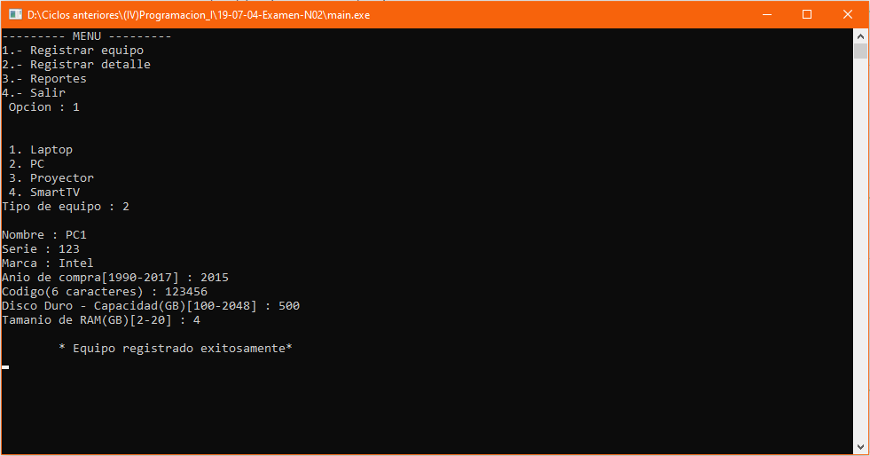
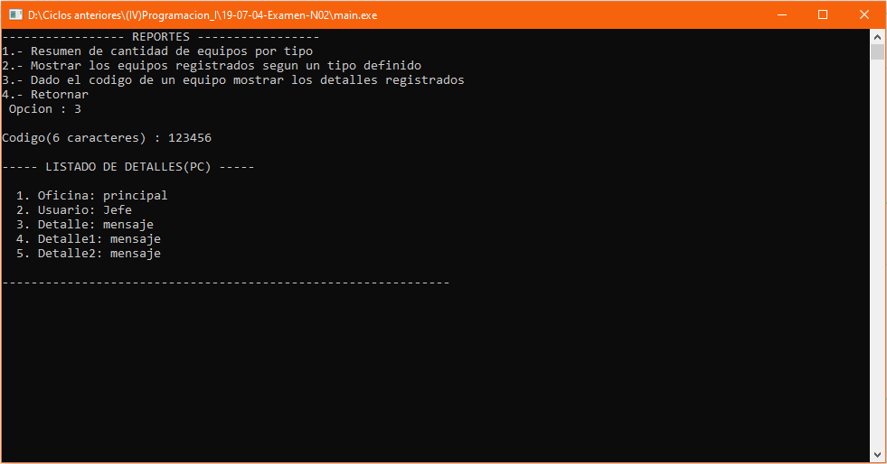

# Gestión de equipos
Sistema de gestión de equipos que permite registrar un equipo, registrar detalles por cada equipo registrado; en los reportes tenemos cantidad de equipos registrados por su tipo, mostrar los equipos registrados según su tipo, mostrar los detalles registrados según el código del equipo, **04/07/19**.

<strong>Imagen:</strong> Menú principal - Registrar equipo.

<strong>Imagen:</strong> Menú de reportes - Reporte 03.

